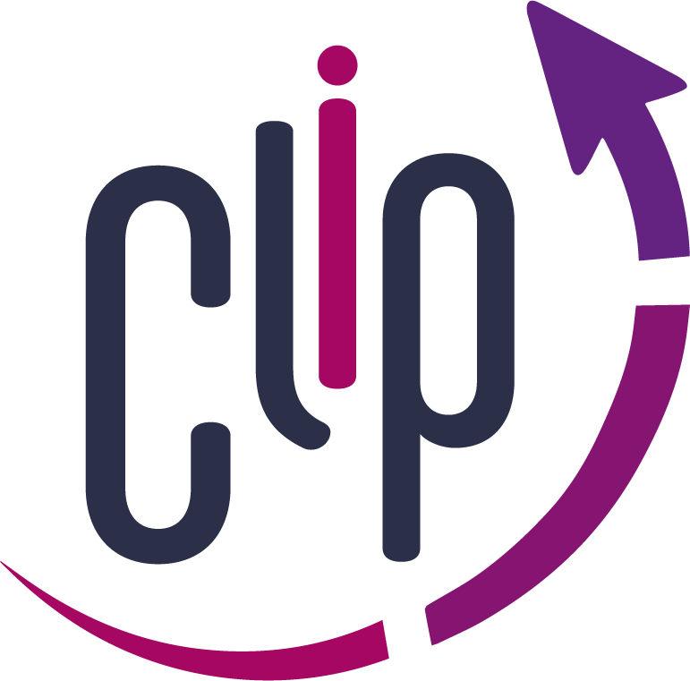
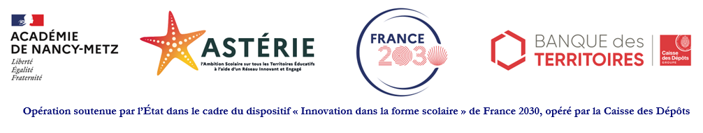

::::::::::::::::::::::::::::: clip-shell
::::: clip-hero
::: clip-intro
{.clip-logo fig-alt="Logo CLIP-ASTERIE"}

Une formation par l'[ENSGSI de l'Université de Lorraine]{.clip-eyebrow}

# CLIP-ASTERIE

[Programme d’Incubation d’Équipes d’Innovation Collaborative]{.clip-subtitle}

Un parcours collectif pour développer vos tiers-lieux éducatifs, expérimenter vos idées et construire la suite ensemble.

[Découvrir le parcours](parcours/index.qmd){.btn .btn-primary}
:::

::: clip-next
[Votre prochaine étape]{.clip-eyebrow}

## Le kick-off

Rendez-vous à la **Cab'Inn** - 8 rue Bastien Lepage, 54000 Nancy.

  
Date à confirmer

  

  <noscript>Consultez la page de l’étape pour connaître sa date.</noscript>

[Préparer le kick-off](parcours/kickoff.qmd){.btn .btn-outline-primary}

:::
:::::

:::::: clip-facts
::: clip-fact
### Pour qui ?

L’équipe de directrices et directeurs des tiers-lieux éducatifs du programme ASTERIE, porté par le rectorat de l’académie de Nancy-Metz.
:::

::: clip-fact
### Quand ?

Du **14 octobre 2026** à **juillet 2027**.

Un kick-off, cinq sprints et un atelier de clôture.
:::

::: clip-fact
### Où ?

En présentiel à l’**ENSGSI** et à distance sur les plateformes de visioconférence de l’Université de Lorraine.
:::
::::::

::::::::::: clip-section
## Votre parcours en sept étapes

Chaque étape associe des objectifs, un atelier et des livrables. Les consignes sont dévoilées progressivement.

:::::::::: clip-journey
::: {.clip-stage .clip-stage-open}
[00]{.clip-step}

### [Kick-off](parcours/kickoff.qmd)

Ambition commune

[Page disponible]{.clip-status}
:::

::: clip-stage
[01]{.clip-step}

### [Sprint 1](parcours/sprint1.qmd)

Ancrer

[À venir]{.clip-status}
:::

::: clip-stage
[02]{.clip-step}

### Sprint 2

[À venir]{.clip-status}
:::

::: clip-stage
[03]{.clip-step}

### Sprint 3

[À venir]{.clip-status}
:::

::: clip-stage
[04]{.clip-step}

### Sprint 4

[À venir]{.clip-status}
:::

::: clip-stage
[05]{.clip-step}

### Sprint 5

[À venir]{.clip-status}
:::

::: clip-stage
[06]{.clip-step}

### Clôture

[À venir]{.clip-status}
:::
::::::::::

[Voir le parcours et le calendrier →](parcours/index.qmd)
:::::::::::

::::::::: clip-section
## Vos mentors

Université de Lorraine · ENSGSI–ERPI

:::::::: clip-mentors
::: clip-mentor
### Élodie Sudol
:::

::: clip-mentor
### [Marcos Medina Tabares](https://erpi.univ-lorraine.fr/membre/marcos-medina-tabares/)
:::

::: clip-mentor
### [Manon Enjolras](https://ensgsi.univ-lorraine.fr/enseignant/manon-enjolras/)
:::

::: clip-mentor
### [Ferney Osorio](https://ensgsi.univ-lorraine.fr/enseignant/ferney-osorio/)
:::

::: clip-mentor
### [Mauricio Camargo](https://ensgsi.univ-lorraine.fr/enseignant/mauricio-camargo/)
:::
::::::::

[Rencontrer l’équipe →](equipe.qmd)
:::::::::

::::: clip-bottom
::: clip-support
## Ce parcours est soutenu par :

{fig-alt="Programme ASTERIE" width="600"}

[Le Projet ASTERIE](https://www.ac-nancy-metz.fr/le-projet-asterie-125636) · [Académie de Nancy-Metz](https://www.ac-nancy-metz.fr/)
:::

::: clip-contact
## Restons en contact

Une question sur le programme ou la préparation d’un atelier ?

[Écrire à l’équipe](mailto:ensgsi-clip-contact@univ-lorraine.fr){.btn .btn-outline-primary}

[ensgsi-clip-contact\@univ-lorraine.fr](mailto:ensgsi-clip-contact@univ-lorraine.fr)
:::
:::::
:::::::::::::::::::::::::::::